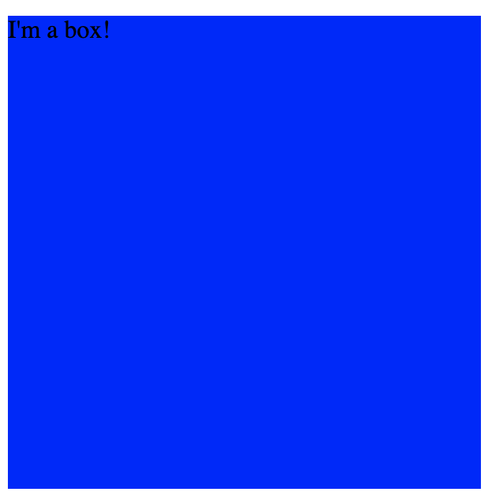
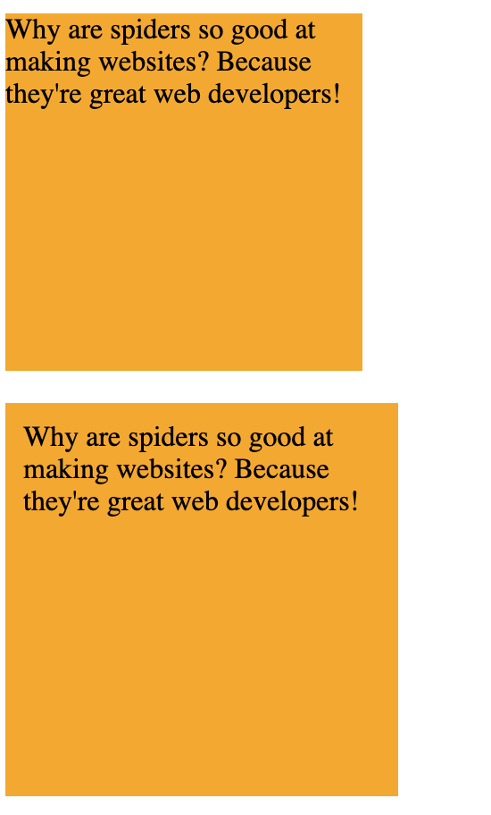
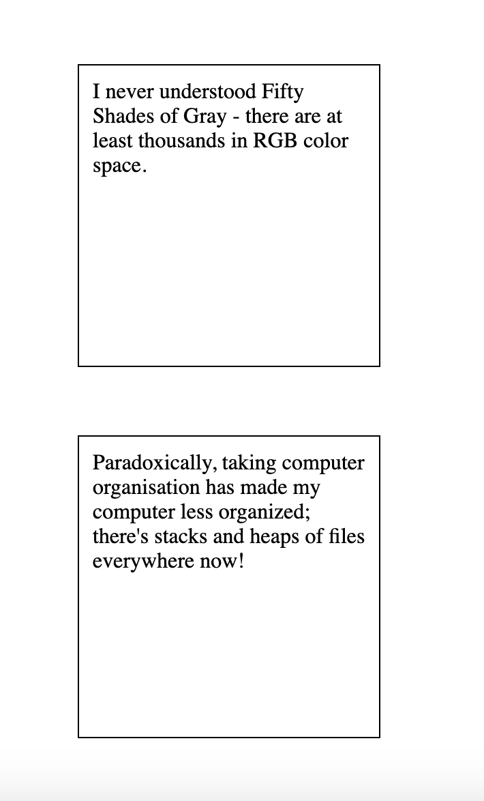
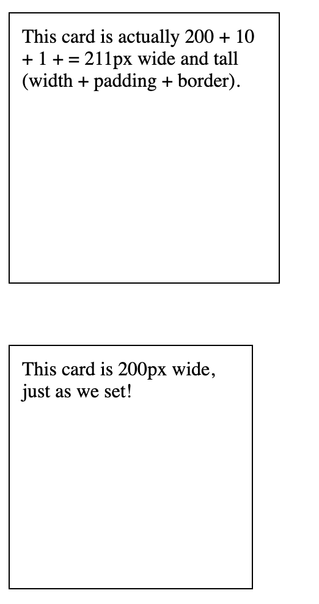

# Intermediate CSS: The Box Model & Positioning

[Link to Workshop Video](https://youtu.be/NuExDOvWBJM)
[Link to Workshop #1 Review](https://docs.google.com/presentation/d/1-Ibtw6U395ofBfUyNlg_4fVs_RTLzK2SN7pSp-ZuDXs/edit?usp=sharing)

## Overview

This session and set of notes covers topics in CSS related to layout and positioning. In particular, we discuss:

* What is the "Box Model"? How does that play into how we view websites?
* What are padding and margin? How are they different?
* What is a block element? An inline element?
* What does the CSS position property due? What do the values absolute, relative, and fixed do?
* How does inheritance in CSS work? (note: this will be light)
* What are floats? (note: this will be light)

We'll assume that you have some experience with HTML & CSS, to the extent that was covered in our previous HTML & CSS workshop.

Let's get started!

## Table of Contents

* [The Box Model](#the-box-model)
  * [The Content Area](#the-content-area)
  * [The Padding Area](#the-padding-area)
  * [The Border Area](#the-border-area)
  * [The Margin Area](#the-margin-area)
  * [Padding vs. Margin](#padding-vs-margin)
  * [Aside: the box-sizing property](#aside-the-box-sizing-property)
* [display:inline and display:block](#displayinline-and-displayblock)
* [The position property](#the-position-property)
  * [A quick aside on z-index](#a-quick-aside-on-z-index)
* [The float property](#the-float-property)
* [Conclusion](#conclusion)
* [Further Reading](#further-reading)
* [Reference Links](#reference-links)

## The Box Model

The **box model** is a core part of HTML and CSS, and you'll likely hear about it more as you read web documentation, talk to web developers, and do front-end interviews. But what exactly does the box model mean?

The box model says that **every HTML element is really just a box**. Simple, right? But, there's a bit more. In particular, it says that each box is comprised of four (somewhat concentric) rectangles that describe the layout of element. These four rectangles (or areas, zones, parts), are called:

1. The Content Area
2. The Padding Area
3. The Border Area
4. The Margin Area

Before we discuss each of these areas, it would be helpful if we could see a diagram explaining what we mean. Here's one, courtesy of the Mozilla Developer Network:


Was that confusing? Hopefully not, but let's break each portion down.

### The Content Area

The content area contains, well, your content. By default, the size of this area is determined by the size of your content: a `400px` image will have a content area of size `400px`, and text *generally* fills as much space as possible (though we'll go into this more in a bit). In addition, we've played around with the `width` and `height` attributes: by default, the `width` and `height` attributes only affect the content area.

This is the easiest area to think about and examine. We can do this with a very trivial code example:

```css
/* CSS file */
.box {
  width: 300px;
  height: 300px;
  background-color: blue;
}
```

```html
<!-- HTML FILE -->
<div class="box">
  I'm a box!
</div>
```



A good question that you might be asking is "what are the default `width` and `height` values for the content area?". That's a *very* good question, and we promise we'll get there by the end of this session.

### The Padding Area

Now, let's throw our next box in. The **padding** of a box surrounds the content area with whitespace. I You can control the `padding` of a box with a set of CSS properties, such as:

* `padding-top: 5px;`, which would add 5 pixels of padding to the top of a content area
* `padding-right: 5px;`, which would add 5 pixels of padding to the right of a content area
* `padding-bottom: 5px;`, which would add 5 pixels of padding to the bottom of a content area
* `padding-left: 5px;`, which would add 5 pixels of padding to the left of a content area
* `padding: 5px;`, which adds 5 pixels of padding to the top, right, bottom, and left of a content area

When we say *whitespace*, we mean that there is nothing there, *transparently*; that is to say, we will display whatever is the background of the element.

Let's also take a look at this with a code example. One very common use case of `padding` is to "pad" some text, to make it more visually appealing.

```css
/* CSS file */
.orange-box {
  background-color: orange;
  width: 200px;
  height: 200px;
}
.padded-orange-box {
  background-color: orange;
  width: 200px;
  height: 200px;
  padding: 10px;
}
```

```html
<!-- HTML FILE -->
<div class="orange-box">
  Why are spiders so good at making websites? Because they're great web developers!
</div>
<br />
<div class="padded-orange-box">
  Why are spiders so good at making websites? Because they're great web developers!
</div>
```



The padded box looks better, and it's easier to read! Note that the second box is actually bigger: even though the `width` and the `height` is the same, that only affects our content area: our entire box is actually `220px` by `220px`!

Also, notice that the space between the inside box and the outside box is orange, the `background-color` of the element. We want to emphasize that the "whitespace" that padding creates isn't always white!

By default, if no `padding` property is specified, the browser will assume that `padding: 0px;`.

### The Border Area

Hopefully, the **border area** should be somewhat self-explanatory: it creates a visible border around your padding and content areas. Unlike padding, border related properties all add some sort of color, and can sometimes add patterns as well.

There are a plethora of different options to customize a border (and we recommend you take a look at some documentation when you have the chance), but for now, we'll examine the `border` property (which is in reality shorthand for `border-width`, `border-style`, and then `border-color`).

This is best explained visually. Let's look at this with another common code example, a simple "card" element:

```css
/* CSS file */
.text-card {
  width: 200px;
  height: 200px;
  padding: 10px;
  border: 1px solid black;
}
```

```html
<!-- HTML FILE -->
<div class="text-card">
  I never understood Fifty Shades of Gray - there are at least thousands in RGB color space.
</div>
```


Here, the `border: 1px solid black;` is telling us:

* the border should be `1px` wide
* the border should be `solid` (it could also be dashed)
* the border should be `black`

Also, note that the border goes around both the content and the padding! And, the border itself is adding to the size of our box: the total size of `.text-card` is actually `221px` now!

### The Margin Area

Last, but not least, let's talk about margin! Margin operates somewhat similarly to padding, in that we'll add some space around the element. Like `padding`, there's:

* `margin-top`
* `margin-right`
* `margin-bottom`
* `margin-left`
* and the shorthand `margin`

Let's take a look at an example with all of our elements in play, building on our card example:

```css
/* CSS file */
.text-card-mb {
  width: 200px;
  height: 200px;
  padding: 10px;
  border: 1px solid black;
  margin-bottom: 50px;
}
```

```html
<!-- HTML FILE -->
<div class="text-card-mb">
  I never understood Fifty Shades of Gray - there are at least thousands in RGB color space.
</div>

<div class="text-card-mb">
  Paradoxically, taking computer organisation has made my computer less organized; there's stacks and heaps of files everywhere now!
</div>
```


Notice that, in addition to the padding within the box, we've now added space between the boxes: `50px` to be exact!

There is one difference between the behaviour of margin and padding, other than their difference in order respective to the box model. Margins "collapse": that is to say, if two elements on top of each other have `margin-bottom: X;` and `margin-top: Y;`, the total space won't be `X + Y` (as it would for padding); instead, it'll *collapse* the margins, and pick the larger item. We can see this with our text cards:

```css
/* CSS file */
.text-card-spaced {
  width: 200px;
  height: 200px;
  padding: 10px;
  border: 1px solid black;
  margin: 50px;
}
```

```html
<!-- HTML FILE -->
<div class="text-card-spaced">
  I never understood Fifty Shades of Gray - there are at least thousands in RGB color space.
</div>

<div class="text-card-spaced">
  Paradoxically, taking computer organisation has made my computer less organized; there's stacks and heaps of files everywhere now!
</div>
```



Note that the visual distance between the two cards is the same as our previous example, even though we've changed the `margin-bottom: 50px;` to `margin: 50px;`!

### Padding vs. Margin

Often times, you'll want to add some space to your website. You now have two great options in your toolkit: `padding` and `margin`. But, which should you pick?

If you wanted a one-liner, it would look something like this:

> Padding creates space inside an element, while margin creates space between elements.

In general, Matt uses that as a good rule of thumb. However, you'll develop your own internal intuition on which is the right choice to use, and eventually, you'll have more tools in your toolkit to properly space out your webpage.

### Aside: the `box-sizing` property

Technically, what we just described is how margin, border, padding, and content play together when the property `box-sizing: content-box;` is set, which is the default value.

However, you'll often see people set `box-sizing: border-box;` instead (which is something that we often do as well).

What does this do? Well, instead of making `width` and `height` control just the content area, it makes those properties control *the combination of border, padding, and content* instead! This is often very convenient, because you can dynamically size the "bordered content" with `width` and `height` without having to account for the padding or border sizes.

A quick example:

```css
/* CSS file */
.text-card-spaced {
  width: 200px;
  height: 200px;
  padding: 10px;
  border: 1px solid black;
  margin: 50px;
}
.box-sizing-border-box {
  box-sizing: border-box;
}
```

```html
<!-- HTML FILE -->
<div class="text-card-spaced">
  This card is actually 200 + 10 + 1 + = 211px wide and tall (width + padding + border).
</div>

<div class="text-card-spaced box-sizing-border-box">
  This card is 200px wide, just as we set!
</div>
```



It's so convenient, in fact, that some developers (like us) apply the property to all elements:

```css
/* the '*' selector applies to all elements */
* {
  box-sizing: border-box;
}
```

However, you need to **opt-in** to this feature, which is why we explained the box model in this order. It's up to you on which you prefer - just make sure everybody on your team is clear on what you're using!

## `display:inline` and `display:block`

One concept that's closely related to the box model is the `display` property. It turns out, the `display` property has many possible values (including `flex` and `grid`, which we'll go over in a later session), but for now, we'll focus on two very important ones: `inline` and `block`.

**Block** and **inline** are a mutually exclusive way to describe the behaviour of an element, and in particular, these key properties:

* a block element **takes up the full width of its parent** (unless changed with CSS), while an inline element **only takes up the width of its content** (unless changed with CSS)
* a block element **always starts on a new line**, while an inline element does not

Why is this important? Well first, this describes some of the behaviour of HTML tags that we've used before; note that creating a new `<p>` or `<div>` tag breaks the content on a new line, while tags like `<a>` and `<span>` don't. This is because `<p>` and `<div>` (among many others) are by default block-level elements, while `<a>` and `<span>` are by default inline.

You can change these values with `display:inline` and `display:block`, which happens more often than you might think! To bring forward one example, you'll often see a snippet of code that looks something like this:

```css
.large-img-container {
  width: 600px;
  height: 600px;
  border: 1px solid black;
  background: pink;
}

.small-img-container {
  width: 400px;
  height: 400px;
  border: 1px solid black;
  background: pink;
}

.img-responsive {
  display: block;
  max-width: 100%;
  height: auto;
  margin-left: auto;
  margin-right: auto;
}
```

```html
<!-- images/wash.jpg is 500x500 -->
<div class="large-img-container">
  
</div>
<br />
<div class="large-img-container">
  
</div>
<br />
<div class="small-img-container">
  
</div>
<div class="small-img-container">
  
</div>
```


First, let's look at what this does when the image is smaller than the container. The first (untouched) element is in the top-left, as we'd expect. But, the second one, with `img-responsive`, is horizontally centered. Nice! This is because of `margin-left: auto;` and `margin-right: auto;` (which we'll explain in a moment).


Next, we look at what this does then the image is larger than the container. The first (untouched) element expands past its container, which makes it look ugly. But, the second one, with `img-responsive`, is just within the bounds of its container. Nice! This is because of `max-width: 100%`, which we'll explain in a bit.

In essence, what we've done is horizontally center an image and make it as big as possible in its container. It's necessary for us to set `display:block;`, as the `` is inline by default, and we need to use the property that a block element takes up the full width of its parent for this to work.

While we're on the topic, let's quickly also mention what `max-width` and `auto` do, since they're relevant in the context of block-level elements.

* `max-width` overrides the `width` property, and stops the `width` from ever being larger than the `max-width` property. Basically, this says to never scale the image larger than its original size.
* the `auto` keyword automatically adjusts the value of its property based on the content and context of the element. `height: auto;` keeps the aspect ratio the same as the image gets larger, while `margin-left:auto;` and `margin-right:auto;` "fill" the rest of the space in the block-level element (as our width can't get larger than `100%`, so something else needs to take on the space.

If that didn't make too much sense, that's okay - that was a bit of a hand-wavy explanation. We'll include some resources below that explain that more in-depth.

## The `position` property

We have now discussed layout and spacing, but how do we determine the position of an element? It turns out, there will be many different ways to do so, but one of the earliest ways to do so was with the `position` property. It has five values:

* `static` (the default)
* `relative`
* `fixed`
* `absolute`
* `sticky`

Everything so far we have discussed is what happens when you set `position:static`; elements appear one after another, known as the "normal" flow.

The other `position` values change what the properties `top`, `right`, `bottom`, and `left` do - things we haven't discussed yet. Let's discuss them now!

Each of those properties are an *offset property*, in that they tell the browser how far from the "offset" to place the new content area: for example,

```css
.some-element {
  top: 30px;
  left: 45px;
}
```

Would place that element 30 pixels from the top, and 45 from the left of its reference point.

But what is the reference point? That's what each of `relative`, `fixed`, and `absolute` describe:

* `relative`: the reference point is where the content area would be normally, i.e. before using `top`, `right`, `bottom`, and `left`. In our example, this would shift our element 30 pixels down, and 45 to the right.
* `fixed`: the reference point is the **viewport**, which is a fancy name for the edge of the browser. In our example, our element would be 30 pixels down and 45 to the right of the top-left corner of the screen, and it'll stay there **even when we scroll**.
* `absolute`: the reference point is the first parent that has `position` not equal to `static` (choosing the entire document if needed). In our example, our element would be 30 pixels down and 45 to the right of the top-left corner of the top of the page, and will move away as we scroll.

These are harder to demonstrate with screenshots, so we recommend that you visit [this W3Schools Demo](https://www.w3schools.com/css/css_positioning.asp) for more information!

Okay, and what about `position: sticky`? This one is a bit more complicated, and depends on the scroll position of the website. From a high level,

* by default, we treat it as `postion: relative`
* if the user has "scrolled past" where the element is on the website, it then becomes `position: fixed`

Why would we want this property? It turns out, it's very useful in creating navigation bars and table headers - something you'll probably do as a web developer at some point.

You can see a demo and more information on the [MDN Page](https://developer.mozilla.org/en-US/docs/Web/CSS/position#Sticky_positioning).

### A quick aside on `z-index`

If you're thinking carefully, you might have the question: what happens when two elements overlap? What chooses what goes on top of what?

The answer is the `z-index` property, which we don't have too much time to go in-depth in the presentation. The very short answer is that if you think of the webpage as being governed by the x-axis and the y-axis, the natural "z-axis" would point at you, coming out of the monitor. By setting the `z-index` property, we can dictate the position of elements along this "z-axis". For example, an element with `z-index: 999` is "closer to you" than an element with `z-index: 100`, so it'll be on top. By default, elements have `z-index: 0`.

You should read more about `z-index`; the [MDN page](https://developer.mozilla.org/en-US/docs/Web/CSS/z-index) is pretty manageable.

## The `float` property

The `float` property is another CSS property that specifies position. It is used very frequently with objects appearing in the middle of text, like an image. If you've ever struggled with putting an image in-line with text in Microsoft Word or Google Docs, this is for you!

```css
.float-left {
  float: left;
  background: red;
}

.float-right {
  float: right;
  background: blue;
}
```

```html
<div>
  <div class="float-left">float left!</div>
  <div class="float-right">float right!</div>
  <p>
    You know, balloons tend to keep my spirits up. You know, balloons tend to keep my spirits up. You know, balloons tend to keep my spirits up. You know, balloons tend to keep my spirits up. You know, balloons tend to keep my spirits up.
  </p>
</div>
```


Note how the text wraps around to content not filled by each float - the object is placed "in the middle" of the text, so to speak.

At the end of the day, there's quite a bit more to floats (for example, you often have to use clearfixes or the `clear` property). However, we won't spend too much time on them, as floats are used less and less for layouts in favour of solutions like Flexbox or CSS Grid, both of which we'll cover later. It's still important for you to know what floats are, as they're used heavily by popular libraries/frameworks, and you'll often come across them on StackOverflow looking for CSS help.

## Conclusion

Wow, that was a lot! But, we now have many tools in our CSS toolkit to position things. In particular, we talked about:

* box properties: `padding`, `border`, `margin`, and `width` & `height`
* how the `box-sizing` property affects box properties
* `block` and `inline` elements, and their properties
* the `position` keywords and its possible values: `static`, `relative`, `fixed`, `absolute`, and `sticky`
* a quick mention of how `z-index` works
* a brief mention of `float`

There's no pressure if you don't remember all of this at once! The important thing is that you now know that there are many different ways to position elements, and you have a general idea of how some of them work (Google is your friend)!

Take a quick break, you deserve it! And, if you want to put some of this to use, you can check out our [portfolio task](https://github.com/uclaacm/learning-lab-crash-course-su20/blob/main/task-1-portfolio/README.md)!

## Further Reading

These are tutorials that walk through the concepts we discussed. Reading them isn't required, but they can help consolidate your knowledge and catch details that we might've missed! We abbreviate "Mozilla Developer Network" as "MDN".

* [The box model (MDN)](https://developer.mozilla.org/en-US/docs/Learn/CSS/Building_blocks/The_box_model)
* [Block and inline layout in normal flow (MDN)](https://developer.mozilla.org/en-US/docs/Web/CSS/CSS_Flow_Layout/Block_and_Inline_Layout_in_Normal_Flow)
* [Introducing positioning (MDN)](https://developer.mozilla.org/en-US/docs/Learn/CSS/CSS_layout/Positioning)
* [CSS Layout - the position property (W3 Schools)](https://www.w3schools.com/css/css_positioning.asp)
* [All About Floats (CSS Tricks)](https://css-tricks.com/all-about-floats/)

## Reference Links

These are reference-style documents that go over the concepts and properties we discussed:

* [padding (MDN)](https://developer.mozilla.org/en-US/docs/Web/CSS/padding)
* [margin (MDN)](https://developer.mozilla.org/en-US/docs/Web/CSS/margin)
* [border (MDN)](https://developer.mozilla.org/en-US/docs/Web/CSS/border)
* [width (MDN)](https://developer.mozilla.org/en-US/docs/Web/CSS/width)
* [height (MDN)](https://developer.mozilla.org/en-US/docs/Web/CSS/height)
* [box-sizing (MDN)](https://developer.mozilla.org/en-US/docs/Web/CSS/box-sizing)
* [display (MDN)](https://developer.mozilla.org/en-US/docs/Web/CSS/display) (note this also goes into flex and grid, which we'll cover later)
* [max-width (MDN)](https://developer.mozilla.org/en-US/docs/Web/CSS/max-width)
* [position (MDN)](https://developer.mozilla.org/en-US/docs/Web/CSS/position)
* [z-index (MDN)](https://developer.mozilla.org/en-US/docs/Web/CSS/z-index)
* [float (MDN)](https://developer.mozilla.org/en-US/docs/Web/CSS/float)
* [clear (MDN)](https://developer.mozilla.org/en-US/docs/Web/CSS/clear) (this is related to floats, if you're interested)
